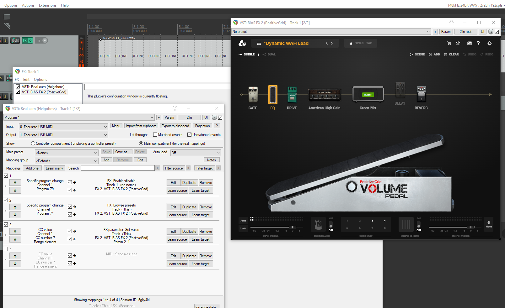

# Intro
Writing this post just as much to remember how to set this up.

This post will center on demonstrating some basic mappings such as controlling an expression pedal(Wah or Volume pedals) in the Bias FX 2 VST Plugin. Regardless of which devices and software used, this is probably general enough to get started.

## Devices and software setup
**Behringer FCB1010 MIDI Foot Controller** connects via 2 MIDI cables to a **Scarlett Focusrite 4i4** audio interface, which in turn connects to a desktop running **Reaper DAW** with **Bias FX 2** VST plugin.

### Cable mapping
Ensure that the MIDI cables are mapped input -> output and vice versa, else you're gonna have a bad time.

## Mapping MIDI inputs in reaper
It's possible to map MIDI inputs in both MIDI tracks and instrumental tracks.
Install ReaLearn using ReaPack, and add ReaLearn as an FX in the instrumental track.

Here's an example setup. ReaLearn allows you to configure your Focusrite as a MIDI input device here.
If you click the learn button, and hit an input on your MIDI Controller, ReaLearn will pick up that signal and map it to the right channel for you, and allows you to map it to an action in either the DAW or your VST.

## Resources used
[MIDI Footswitch Reaper Setup (Fortin Hydra or any MIDI footswitch) ReaLearn](https://www.youtube.com/watch?v=LKEfZdOVFb8)
A bit more thorough than this introduction in video format with a conceptually similar setup, but with different devices and software.

[ReaLearn](https://github.com/helgoboss/realearn#installation)  
VST Plugin that makes mapping the MIDI input a lot easier.

