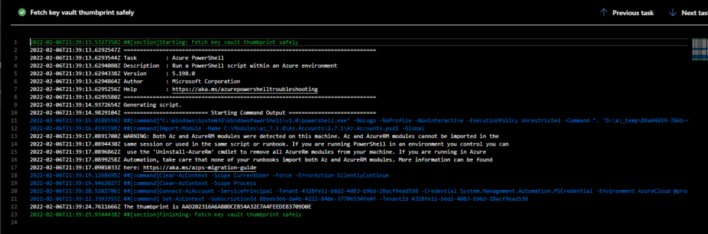
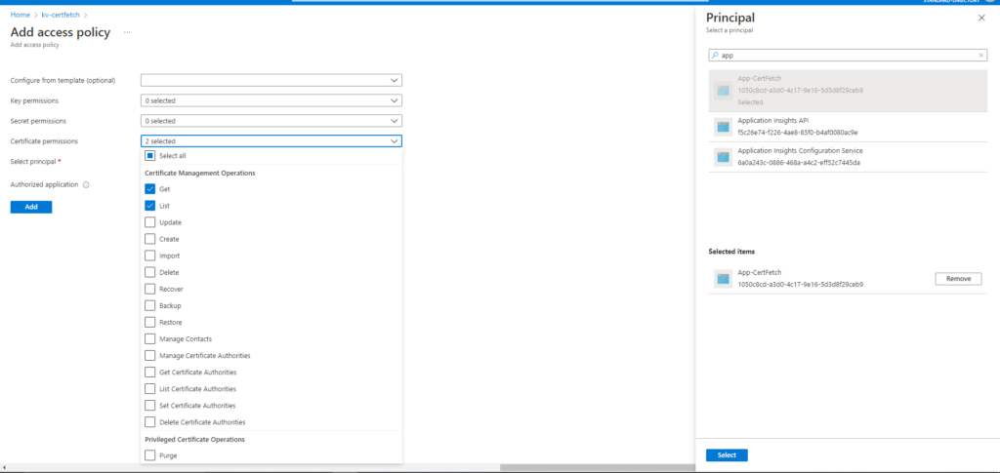
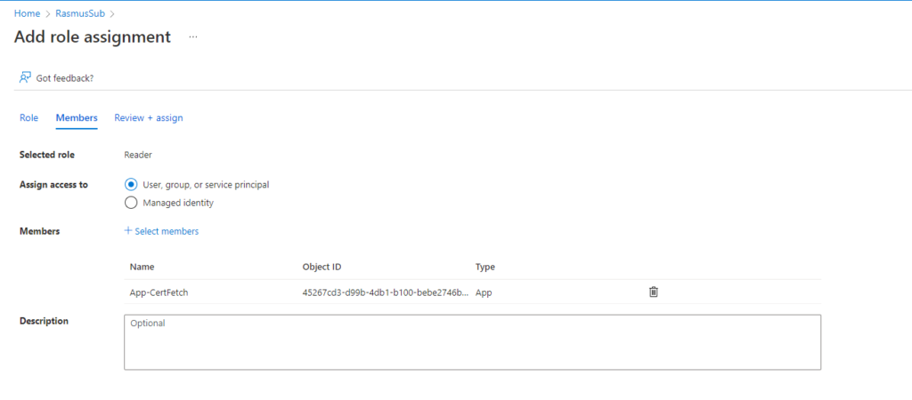
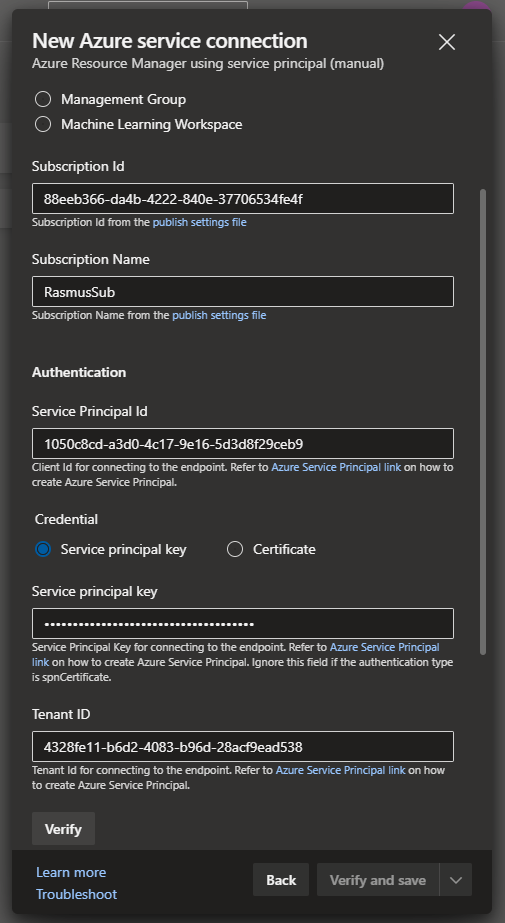

If you for whatever reason need to read your certificates thumbprint(or other public certificate information), such as when deploying to an on-premise environment, then this post can help you.

I needed to do this because we have to feed the IIS Management task the thumbprint for the certificate installed on the server to run HTTPS.

## First method: Using the Azure PowerShell Task

This method is definitely a little more cumbersome than the second method, but will be safer, if you don't want to expose your entire PFX, including secrets. This method instead basis itself on creating a service principal with only rights to read public information about your certificate. On the other hand, linking an Azure DevOps library to a Key Vault requires permission to read secrets as well.

### Prerequisites

- This method uses the [Azure PowerShell task](https://docs.microsoft.com/en-us/azure/devops/pipelines/tasks/deploy/azure-powershell?view=azure-devops)
- Key Vault set up with certificate already set up
- If you run on Azure's deployment agents, you can ignore this bullet, but if you run your own agents, you need to install the [Azure PowerShell Module](https://docs.microsoft.com/en-us/powershell/azure/install-az-ps?view=azps-7.1.0), and ensure you run a sufficient version of PowerShell(7.1.0~ at the time of writing)

### Pipeline setup

Add an Azure PowerShell task to your pipeline. Configure it as an inline script.

Give the task a service connection with a certificate read access principal. See more on this in the next section. Choose to use the latest version of PowerShell.

Add the following script, but replace the variable with your own key vault name and certificate name:

$Thumbprint = (Get-AzKeyVaultCertificate -VaultName "ReplaceWithKeyVaultName" -Name "ReplaceWithCertificateName").Thumbprint

Write-Host "The thumbprint is $Thumbprint"

Write-Host "##vso\[task.setvariable variable=Tp\]$Thumbprint"

This script will grab the certificate's public info, and set the Thumbprint variable with the certificate's thumbprint value.

The task.setvariable function is a logging command that allows you to assign a pipeline variable at runtime. In this case we pipe it into a variable that'll be accessible as $(Tp), which can be used like any other pipeline variable wherever you need it.

### Creating the service connection

Here it's assumed that you already have a key vault an certificate configured.

First thing you need to do is create an application in your Azure AD.  
Add a regular text secret to the application as well. You'll need this for the service connection.

Now go to your key vault, and add the following access policy. Give Get and List access on certificates, and select your newly created application as the service principal, and save.

Before you can set up the service connection you also need to assign the reader role to your application on your subscription. Go to your subscription, and navigate to the role assignment.

Now you can configure your service connection in Azure DevOps with the variables from your subscription and service principal. In Azure DevOps navigate to the new service connection wizard. Select Azure Resource Manager as your connection type, and select the option to authenticate using a manual service principal.

Now you should be good to throw it into your Azure PowerShell task, and give it a go!

## Second method: Connect an Azure DevOps library to a key vault

This method is way simpler, but will expose your full certificate, including private keys. As above, create a service connection, but add the option to list and get secrets.

You can now simply create a library in Azure DevOps, and choose the option to link it to your certificates using the service connection. The certificate will be available as a Base64-encoded string under the certificate's own variable name.

You can simply use Powershell to read the certificate string and parse it into an X509 certificate, and assign it to a runtime variable using the task.setvariable function mentioned in the first approach.
