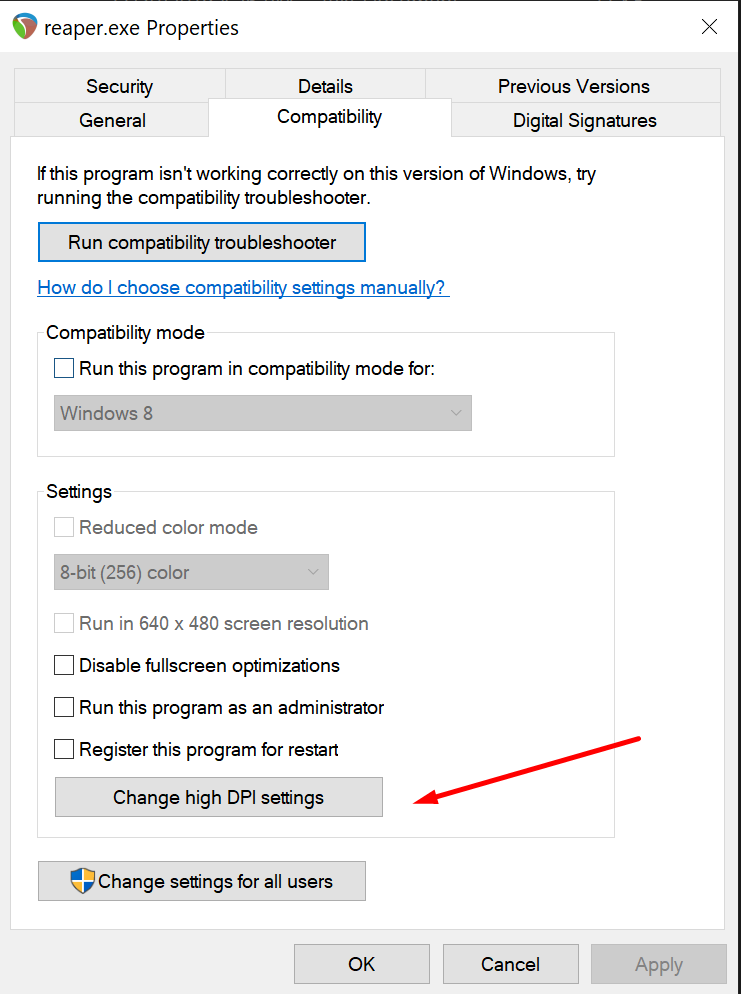
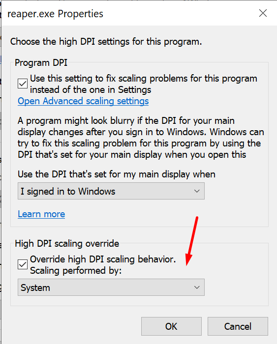
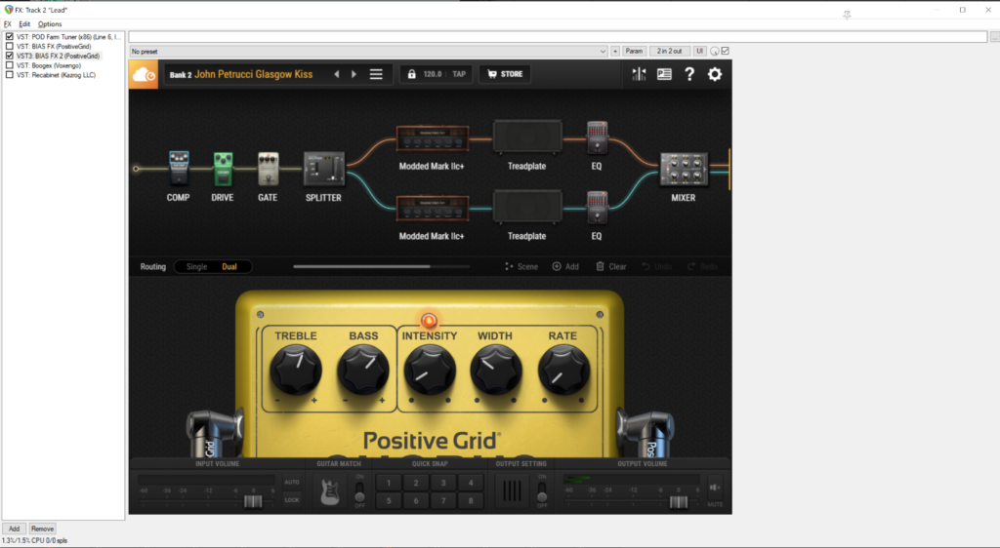

A simple fix that'll help Reaper scale VST UIs up on HDPI screens on Windows 10.

I was unable to run BIAS FX 2, because my high HDPI screen would only render a quarter of the VST UI.

This simple requires changing a setting for the Reaper executable.

Right-click the reaper.exe file -> Select **Compatibility** -> Select **Change high DPI settings** -> Enable **Override high DPI scaling behavior** and select **System** in the dropdown as shown below:

Select **Change high DPI settings**

Use **System** for scaling

Now your VST UI should look completely normal:

