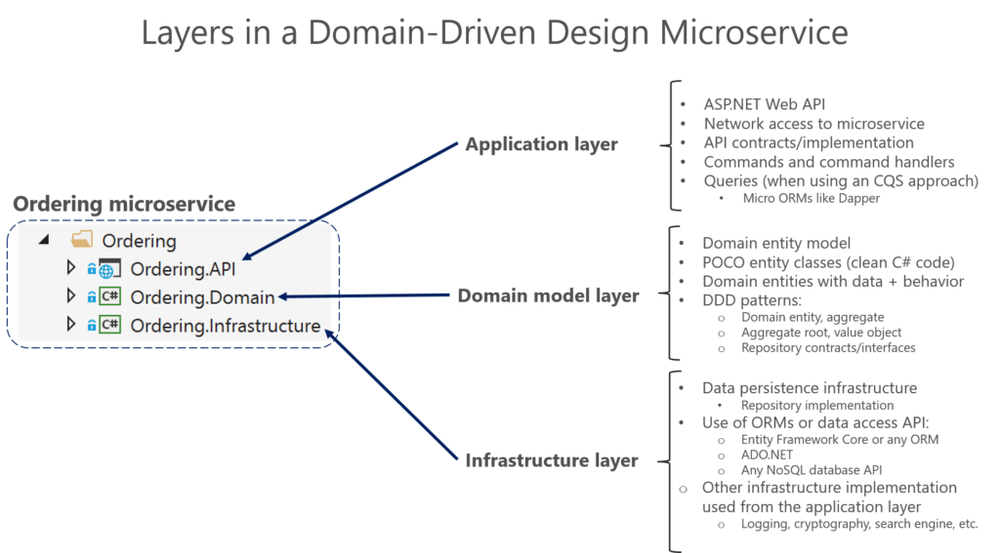

#### The difference between decorator APIs and attributes

You'll run into having to make the decision between using decorator API or decorator attributes often, especially when you're implementing persistence such as by using Entity Framework or the Mongo .NET driver, which both support decorator APIs or decorator attributes.

These decorators are used to describe a given class' relation to the persistence layer, for example which column a given class property gets mapped to, which columns should have an index and so on.

Here's an example of achieving the configuration of a primary key in Entity Framework with a decorator API(Entity Framework fluent API) and with class attributes.

The class might simply look as such:

public class Person {
	public int Id { get; set; }
}

Here the primary key on the Person class gets implemented using the fluent API.

public class PersonDbContext: DbContext 
{
    public DbSet<Person> Persons { get; set; }
        
    protected override void OnModelCreating(ModelBuilder modelBuilder)
    {
        modelBuilder.Entity<Person>()
                .HasKey(p => p.Id);
    }
}

Here the primary key gets implemented using a simple class attribute on the Id property.

public class Person {
	\[Key\]
	public int Id { get; set; }
}

#### When to prefer the fluent API over attributes

The class attribute looks significantly easier to implement, so why would you ever prefer to use the fluent API?

In many cases it'll be more productive to simply use class attributes, but if you're working according to concepts that require you to separate your concepts from your implementation such as when following domain-driven design or clean architecture, you'll spare yourself a lot of pain by using the fluent API.

Taken from https://docs.microsoft.com/en-us/dotnet/architecture/microservices/microservice-ddd-cqrs-patterns/ddd-oriented-microservice

The idea is that the Person class represents your domain, but you are breaking the principle of separating domain from infrastructure, when you add a direct dependency on Entity Framework by placing Entity Framework attributes directly inside your domain class. In this case, Entity Framework technically belongs outside your domain layer as it's simply a way of implementing the persistency necessary to support a repository/unit of work.

You can still achieve the separation of domain and infrastructure by duplicating the Person class, one in the domain layer with the same properties as in the infrastructure layer, where the infrastructure layer Person class simply remains decorated.

However, you can entirely skip the need to duplicate the class, by simply using the fluent API to decorate your domain class. Nobody says you have to implement a DTO infrastructure class for every domain entity; all you need to do is make your that your domain is separated from and unaware of your infrastructure layer.

#### Advantage of decorator attributes

With all this said, please be ware that it might just be your application doesn't need such strict separation of domain and persistence. An advantage of decorator attributes might just be that they keep things simpler and more straightforward. You immediately know that a class with these attributes get managed by Entity Framework, and you get a full idea of the table structure, its indices etc.

On top of that, it's simply significantly faster to add attributes than having to set up and configure the fluent API.  
Finally, it's really not that difficult to migrate from using attributes to using the fluent API should the need arise.
